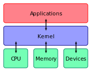

# Say Hi to Tux: A Gentle Introduction to Linux

Image: lewing@isc.tamu.edu and The GIMP

### Electron club - A brief introduction

Welcome to the Electron club, for those who've never been here before this is 
a place where people come to get together to work together and share knowledge
with one another. 

We have many groups who meet here regularly, some relate to Open Source in one
form or another. For more information visit the website at [electronclub.org](http://www.electronclub.org) or talk to one of our members after this event. 

### What are we doing here today?

Hopefully having fun, sharing knowledge and learning from one another.

Specifically today we're here to get a basic introduction to the Linux Operating
system, and learn about some of the underlying concepts of Free and Open Source
Software, or FOSS for short.

After today there is a feedback form available on the website, all constructive
feedback is welcome, if you could fill that out it would be great.

<insert link & QR Code here>

### What does Open Source mean?

Let's start with an analogy, a fairly common occurrence we'll understand if not
have undertaken ourselves.

Suppose you make a soup, you're free to write down a recipe, the ingredients 
and the method for making the soup, and share this with anyone. The people you
have shared your recipe with are free to share it with whomever they please.

The people who now have your recipe can alter it to suit their tastes, and can
feed these changes back to you. They are free to share their version of the 
recipe with others.

This is similar to Open Source software and hardware. The blueprints for 
the project are made available at no cost. This includes source code and 
documentation in the case of open source software, and blueprints/schematics
and documentation in the case of open source hardware. 

This means that anyone can use and improve open source projects and everyone 
can gain from collaborative nature of making something better by working 
together.

End users who are not developers benefit from having the products to use at no
financial cost, but can contribute in other ways. Communities exist sharing 
advice and answering user questions about Open Source products. Unlike the 
proprietary route 

Many people don't know that it's already powering things they own, from
smart phones, top of the line gaming consoles (e.g. Sony PS4) to broadband 
routers, bluray players and even fancy fridges. 

Chances are you already use Open Source every day without even knowing it.

### The Open Source ethos

People are users or contribute to Open Source for various reasons.

* The right to free software akin to the right to freedom of speech
* Collaboration, together we can achieve most
* Using what skills we have to make the world a better place
* Some are paid by their employers as users of open source to contribute
* Something else (ask around the room)
* A combination of the above

### Open Source Software and Hardware

The open source methodology is applicable to software and hardware, among other things. 

#### Software

As touched upon previously, if you can imagine it there is likely an Open Source
offering. Here are a few of the types of open source software products:

* Operating systems (Linux, FreeBSD etc)
* Office suites (Libre Office, Open Office etc)
* Image editing (Gimp, Dark Table etc)
* Video editing (OpenShot, Kdenlive etc)
* Video/Audio players (VLC, Banshee etc)
* Web Browsers
* Programming languages and tools
* Productivity tools
* Games....
* Simply too many things to mention

#### Hardware

* Computers
* Cameras
* Robots
* Medical devices
* Musical Instruments
* 3D printers
* CNC Machines
* Laser Cutters
* Physical objects which can be printed or milled
* etc

### What is Linux?

When most people talk about Linux they're really talking about an Operating 
system based upon the Linux Kernel. There are literally hundreds of 
different Linux distros available to download. Many of these based upon a 
major distribution, e.g. Ubuntu is based upon Debian, many of the minor 
distributions are specifically targeted towards a device or use case, such as 
Raspbian, a Debian based distro specifically for use with the Raspberry Pi 
computer (or clones which use the same setup).

Linux distros are used extensively in business as well as academia and in the 
home. Most of the infrastructure the powers the internet is Linux based, 9 out 
of the top 10 super computers, Google, Facebook, YouTube, Twitter and other
vastly popular services are Linux powered.

	

The Linux kernel is the core of all of these Linux distributions.  A kernel is
the core of any operating system. Basically, the Kernel does the hard task of
talking to the hardware and software and to manage the resources (such as RAM, 
CPU time etc) available to system as best as possible. 

The Linux Kernel is now over 13 million lines of code, contributed by a vast number of developers from all over the world. Arguable this is the largest collaborative work in the history of mankind.

So the Kernel is the guts of the operating system, upon which everything is dependant.

Now we'll move onto a demonstration Linux installation, during this process we'll gain a better idea of how all of the parts come together to give the desktop experience most people are familiar with. This also gives us the chance to discuss the Linux graphical front end, why there are so many to choose from, then onto the powerful back end terminal interface to Linux.
